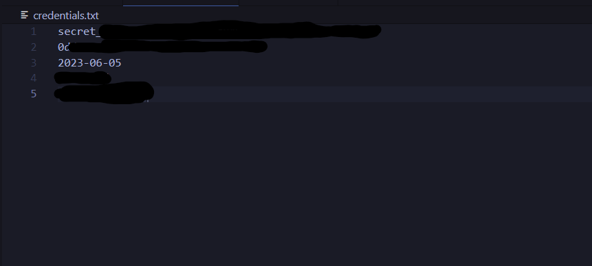

# Ecoledirecte-Notion
Reliez vos informations ecoledirecte à votre database Notion

## Comment faire fonctionner le script
-> ouvrez le fichier credentials.txt
1. ajouter sur la première ligne du fichier votre code d'API secret (pour se faire vous devez créer une integration sur cette page : https://www.notion.so/my-integrations)
2. ajouter sur la deuxième ligne du fichier l'ID de votre database -> 
3. ajouter la date dont vous souhaiter récuperer l'emploi du temps /!\ Notion utilise la norme ISO8601 pour la date veuillez la respecter (modèle sous la forme YY-MM-DDThh:mm)
4. ajouter votre nom d'utilisateur ecoledirecte
5. ajouter votre mot de passe ecoledirecte

Votre fichier credentials.txt doit être semblable à cela :

Il ne vous reste plus qu'à lancer le script ou l'héberger sur un VPS et automatiser les dates pour que le script fonctionne.
